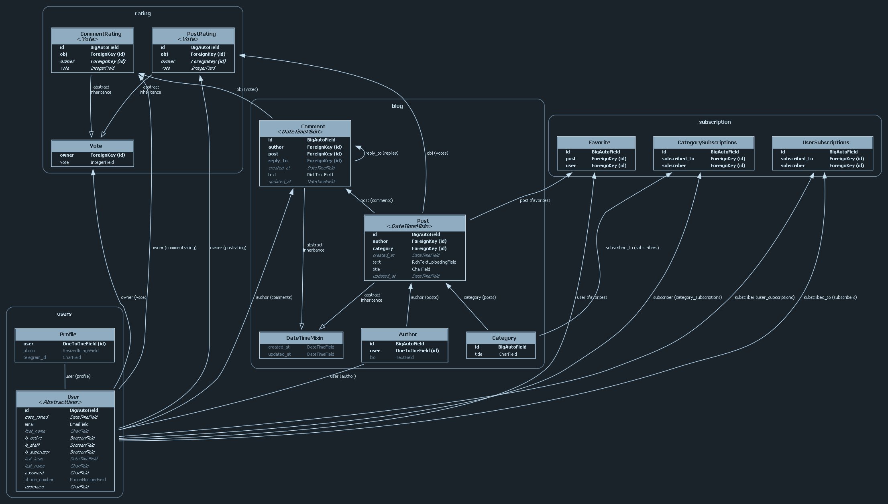

# Language
- **ru** **Русский**
- **en** [English](README.md)

# Блоговый веб-сервис
[](https://github.com/GSPVK/DjangoDRF-blog/actions/workflows/django.yml)
[]()
[]()
[]()
[]()

Проект построен на стеке **Django** и **Django REST Framework (DRF)**. Особенность проекта заключается в демонстрации двух различных подходов к реализации 
одинакового функционала: с помощью классического Django и через API, созданный с помощью DRF.

**Демо-сайт доступен по адресу:** https://djangoblog.space/

# Содержание
- [Описание](#-два-подхода-к-реализации-функционала)
- [Возможности](#-кратко-о-возможностях)
- [UML diagram](#uml-diagram)
- [Использованные технологии](#-использованные-технологии)
- [Расширения и приложения](#расширения-и-приложения)
- [Перед установкой](#перед-установкой)
- [Установка](#установка)
- [Хотите что-то предложить?](#хотите-что-то-предложить)

## Два подхода к реализации функционала:
Проект позволяет сравнить два способа реализации одного и того же функционала. Вы можете увидеть, как решаются одни и те же задачи 
с использованием стандартных представлений, форм и шаблонов в классическом Django и с использованием сериализаторов, вьюсетов и роутеров в DRF.

## Кратко о возможностях:

- **Система пользователей**:\
Регистрация, аутентификация, профили для пользователей.

- **Посты**:\
Публикация, редактирование и удаление постов (весь CRUD).

- **Категории**:\
Посты классифицируются по категориям.

- **Комментарии**:\
Возможность оставлять комментарии к постам. Ответы на комментарии (дерево комментариев).

- **Форматирование**:\
Форматирование и sanitize текста постов и комментариев обеспечивается с помощью [django-ckeditor](https://django-ckeditor.readthedocs.io/en/latest/) и [django-bleach](https://django-bleach.readthedocs.io/en/latest/).

- **Рейтинг**:\
Пользователи могут оценивать посты и комментарии (лайк/нейтрально/дизлайк).

- **Подписки и фид**:\
Пользователи могут подписываться как на других пользователей так и на категории. Из этого формируется фид.

- **Избранное**:\
Пользователи могут добавлять посты в избранное.

## UML diagram


## Использованные технологии
- [**Django**](https://www.djangoproject.com/) Веб-фреймворк
- [**Django REST Framework (DRF)**](https://www.django-rest-framework.org/) API фреймворк
  

- [**PostgreSQL**](https://www.postgresql.org/) Основная БД
- [**Redis**](https://redis.io/) БД для кэширования
  

- [**Celery**](https://docs.celeryproject.org/en/stable/) Асинхронный планировщик задач
- [**RabbitMQ**](https://www.rabbitmq.com/) Брокер сообщений
  

- [**Docker**](https://www.docker.com/) Контейнеризация
- [**Nginx**](https://nginx.org/en/) Веб-сервер. В проекте используется [данный образ](https://hub.docker.com/r/jwilder/nginx-proxy/)
- [**Gunicorn**](https://docs.gunicorn.org/en/stable/) WSGI HTTP-сервер
  

- [**Bootstrap**](https://getbootstrap.com/) CSS фреймворк

## Расширения и приложения
Здесь описаны некоторые (само собой не все) пакеты, приложения и достойные упоминания функции.

- **Packages and extensions**:
    - **[django-debug-toolbar](https://github.com/jazzband/django-debug-toolbar)** - дебаг-панель для сайта.
    - **[jazzmin](https://django-jazzmin.readthedocs.io/)** - кастомная админка
    - **[django-ckeditor](https://django-ckeditor.readthedocs.io/en/latest/)** - WYSIWYG html редактор текста.
    - **[django-bleach](https://django-bleach.readthedocs.io/en/latest/)** - валидация и очистка html.
    - **[simplejwt](https://django-rest-framework-simplejwt.readthedocs.io/en/latest/)** - JWT бэкенд аутентификации для API.
    - **[django celery results](https://pypi.org/project/django-celery-results/)** - хранит результаты работы Celery в БД.
    - **[flower](https://flower.readthedocs.io/en/latest/)** - веб-мониторинг для Celery.
  

- **Django apps**:
    - `api` - приложение объединяющее API функционал.
    - `blog` - основное приложение блога.
    - `users` - приложение пользователей.
    - `common` - приложение содержащее общий (не относящийся к какому-то конкретному приложению) функционал.
    - `rating` - несёт в себе функционал для оценивая комментариев и постов.
    - `subscriptions` - функционал для подписок на юзеров/категории и формирование фида исходя из подписок.


- **Стоит упомянуть**:
    - `create_default_groups` - команда manage.py приложения blog. Создаёт 2 группы - bloggers и readers, даёт разрешение блоггерам на создание постов (разрешение проверяется в шаблоне blog/post_list (line 34)).
    - Кастомный бэкенд авторизации. Пользователь может залогиниться либо с помощью юзернейма либо посредством e-mail.
    - Кастомные менеджеры для моделей `blog.Post` и `blog.Comment`, в которых выполняется оптимизированная загрузка списка постов/комментариев и добавление необходимых аннотаций (оценка, в избранном ли и т.д.) для request.user (если таковой имеется).
    - Сигналы приложения Blog:
        - Так как фильтрация по категориям закэширована (дабы избежать лишних запросов к редко меняющейся таблице) существует сигнал `update_category_cache` срабатывающей при редактировании таблицы Category. 
        - При присвоении пользователю группы Bloggers создаётся инстанс в модели Author (`create_or_delete_blog_author`). При удалении из группы инстанс, соответственно, удаляется. 
        - Суперюзеры сразу становятся блоггерами (`blog.signals.ensure_superusers_have_blogger_group_membership`)
    - Сигналы приложения Common:
        - Содержит модуль сигналов для работы с CKEditor. Сигналы анализируют какие картинки были добавлены/удалены из поста и выполняют необходимые действия (привязка/отвязка картинки к посту(-ам) в БД, удаление картинок с сервера)
    - Интеграция с CKEditor (расположена в приложении Common):
        - Модель `CKEditorPostImages` хранящая uri картинок в одном поле и посты, к которым прикреплена картинка посредством m2m связи, в другом поле.
        - Middleware `CKEditorPostMiddleware`, который отлавливает картинки загруженные через редактор и делает ресайз (отправляя в Celery соответствующую задачу) при превышении заданного размера (full hd).
        - Описанные выше сигналы.
    - Сообщения об ошибках:
        - Django Рендерит страницы для ошибок 400, 403, 404, 500 (шаблоны расположены в директории `templates/`)
        - nginx. Отлавливает ошибки 50x. Шаблон ошибок nginx сконфигурирован в файле `nginx/50x.html` и [соответствующем volume](https://github.com/nginx-proxy/nginx-proxy/tree/main/docs#custom-error-page) (`./docker/nginx/custom_50x.html:/usr/share/nginx/html/errors/50x.html:ro`). 

## Перед установкой
В проекте предусмотрено 3 compose файла:
- [**docker-compose.debug.yml**](docker-compose.debug.yml) - дебаг конфигурация. В ней отсутствует nginx и сертификация. Имеет свои volumes и другой entrypoint (docker/scripts/debug-server-entrypoint.sh) 
в котором отсутствует gunicorn в пользу стандартного django сервера. Запускается на портах 80:80.
- [**docker-compose.staging.yml**](docker-compose.staging.yml) - конфигурация, запускающая процесс сертификации в [staging environment](https://letsencrypt.org/docs/staging-environment/) дабы убедиться, что всё настроено корректно и процесс сертификации успешен.
- [**docker.compose.prod.yml**](docker-compose.prod.yml) - конфигурация для запуска в прод. При первом запуске попытается получить уже настоящий сертификат.
  
#### **ВАЖНО!** 
- При переключении между debug и prod не забывайте менять значение переменной DEBUG в .env (!)
- При наличии проблем с конфигурацией nginx, проверьте как у вас сгенерирована конфигурация с помощью команды `docker exec nginx-proxy cat /etc/nginx/conf.d/default.conf`

#### **Сертификация, подробнее**
`VIRTUAL_HOST` (и `VIRTUAL_PORT`) необходимы для того, чтобы `nginx-proxy` мог автоматически создавать конфигурацию обратного прокси.
`LETSENCRYPT_HOST` используется для того, чтобы `nginx-proxy-companion` мог выпустить сертификат Let's Encrypt для вашего домена.
Поскольку приложение Django будет прослушивать порт 8000, мы также устанавливаем переменную окружения `VIRTUAL_PORT`.
Том `/var/run/docker.sock:/tmp/docker.sock:ro` в `docker-compose.staging.yml` используется для отслеживания вновь зарегистрированных или удалённых контейнеров.

Контейнер ACME должен делить следующие тома с nginx-proxy:

    certs:/etc/nginx/certs хранит сертификаты, приватные ключи и ключи учетных записей ACME.
    html:/usr/share/nginx/html записывает файлы для проверки подлинности через http-01.
    vhost:/etc/nginx/vhost.d изменяет конфигурацию виртуальных хостов.

`VIRTUAL_HOST` должен включать только ваш основной домен. Если у вас есть `www.example.com`, он должен быть задан как `example.com`.
Это связано с тем, что при генерации сертификатов certbot будет использовать ваш основной домен для создания сертификата, который будет действителен 
как для домена с www, так и для домена без www.

## Установка
#### Клонируйте репозиторий на свой ПК и перейдите в директорию проекта:
```
$ git clone https://github.com/GSPVK/DjangoDRF-blog
$ cd DjangoDRF-blog
```
#### Скопируйте файл .env.example и переименуйте его в .env:

```sh
cp .env.example .env
```

### Для простых тестов 
Просто выполните следующие 5 команд:
```shell
$ poetry install
$ poetry run python manage.py migrate
$ poetry run python manage.py create_default_groups
$ poetry run python manage.py createsuperuser
$ poetry run python manage.py runserver
```

### Docker
#### Переменные окружения
Для успешного процесса сертификации вам так же нужно определить следующие переменные для сервиса `web` в файлах [docker-compose.staging.yml](docker-compose.staging.yml) и [docker-compose.prod.yml](docker-compose.prod.yml)
- `VIRTUAL_HOST=<your_domain.com>`
- `VIRTUAL_PORT=<same_as_exposed_port>`
- `LETSENCRYPT_HOST=<your_domain.com>`
- `LETSENCRYPT_EMAIL=<your_email>`
#### Соберите проект:
1. Запустите проект в докере и попытайтесь получить тестовый сертификат. Если у вас получилось - переходите к следующему шагу. Если нет - устраните ошибки.
```sh
docker compose -f docker-compose.staging.yml up
``` 

2. Остановите сервис.
```sh 
docker compose -f docker-compose.staging.yml down
```

3. Теперь вы можете запустить prod версию:
```sh 
docker compose -f docker-compose.prod.yml up
```

#### (Опционально) Установите фикстуры
```sh
docker compose -f <ИСПОЛЬЗУЕМЫЙ-COMPOSE.YML> exec web poetry run python manage.py loaddata fixtures/fixtures.json
```

#### Создайте администратора:
```sh
docker compose -f <ИСПОЛЬЗУЕМЫЙ-COMPOSE.YML> exec -it web /bin/sh
poetry run python manage.py createsuperuser
```

## Хотите что-то предложить?
Если вы видите что-то, что можно улучшить, вы можете открыть issue или pull-request. Ваш вклад приветствуется!