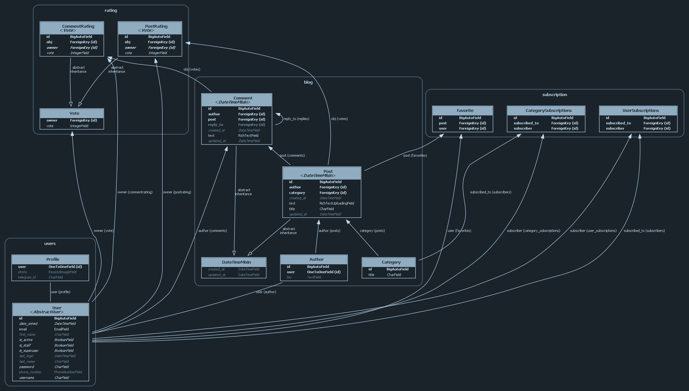

# Language
- **ru** [Русский](README-ru.md)
- **en** **English**

# Blog Web Service
[](https://github.com/GSPVK/DjangoDRF-blog/actions/workflows/django.yml)
[]()
[]()
[]()
[]()

The project is built on the **Django** and **Django REST Framework (DRF)**. stack. The key feature of 
the project is the demonstration of two different approaches to implementing the same functionality: one with classic Django and the other with an API built using DRF.

**The demo site is available at:** https://djangoblog.space/

# Table of Contents
- [Description](#two-approaches-to-functionality-implementation)
- [Features](#brief-overview-of-features)
- [UML diagram](#uml-diagram)
- [Technologies used](#technologies-used)
- [Extensions and Applications](#extensions-and-applications)
- [Before Installation](#before-installation)
- [Installation](#installation)
- [Have a Suggestion?](#have-a-suggestion)

## Two Approaches to Functionality Implementation:
The project allows you to compare two ways of implementing the same functionality. 
You can see how the same tasks are solved using standard views, forms, and templates in classic Django, and using serializers, viewsets, and routers in DRF.


## Brief Overview of Features:

- **User System**:\
Registration, authentication, and user profiles.

- **Posts**:\
Create, edit, and delete posts (full CRUD functionality).

- **Categories**:\
Posts are organized into categories.

- **Comments**:\
Users can leave comments on posts, with support for threaded replies.

- **Formatting**:\
Text formatting and sanitization for posts and comments is handled by [django-ckeditor](https://django-ckeditor.readthedocs.io/en/latest/) and [django-bleach](https://django-bleach.readthedocs.io/en/latest/).

- **Rating**:\
Users can rate posts and comments (like/neutral/dislike).

- **Subscriptions and Feed**:\
Users can subscribe to other users or categories, which generates a personalized feed.

- **Favorites**:\
Users can add posts to their favorites.

## UML diagram


## Technologies Used
- [**Django**](https://www.djangoproject.com/) Web framework
- [**Django REST Framework (DRF)**](https://www.django-rest-framework.org/) API framework
  

- [**PostgreSQL**](https://www.postgresql.org/) Primary database
- [**Redis**](https://redis.io/) Caching database
  

- [**Celery**](https://docs.celeryproject.org/en/stable/) Asynchronous task scheduler
- [**RabbitMQ**](https://www.rabbitmq.com/) Message broker
  

- [**Docker**](https://www.docker.com/) Containerization
- [**Nginx**](https://nginx.org/en/) Web server. The project uses [this image](https://hub.docker.com/r/jwilder/nginx-proxy/)
- [**Gunicorn**](https://docs.gunicorn.org/en/stable/) WSGI HTTP server
  

- [**Bootstrap**](https://getbootstrap.com/) CSS framework

## Extensions and Applications
This section describes some of the packages, applications, and noteworthy features.

- **Packages and extensions**:
    - **[django-debug-toolbar](https://github.com/jazzband/django-debug-toolbar)** - Debug panel for the site.
    - **[jazzmin](https://django-jazzmin.readthedocs.io/)** - Custom admin interface.
    - **[django-ckeditor](https://django-ckeditor.readthedocs.io/en/latest/)** - WYSIWYG HTML text editor.
    - **[django-bleach](https://django-bleach.readthedocs.io/en/latest/)** - HTML validation and sanitization.
    - **[simplejwt](https://django-rest-framework-simplejwt.readthedocs.io/en/latest/)** - JWT authentication backend for the API.
    - **[django celery results](https://pypi.org/project/django-celery-results/)** - Stores Celery task results in the database.
    - **[flower](https://flower.readthedocs.io/en/latest/)** - Web-based celery monitoring tool.
  

- **Django apps**:
    - `api` - handles all API-related functionality.
    - `blog` - the core app for managing blog posts.
    - `users` - manages user accounts and profiles.
    - `common` - contains shared utilities and functionality used across the project.
    - `rating` - provides the ability to rate posts and comments.
    - `subscriptions` - manages user and category subscriptions, and generates a personalized feed based on those subscriptions.


- **Noteworthy Features**:
    - `create_default_groups` - A manage.py command of the blog app. It creates two groups—bloggers and readers—and grants bloggers the permission to create posts (this permission is checked in the blog/post_list template (line 34)).
    - Custom authentication backend.  Users can log in either with a username or via email.
    - Custom managers for the `blog.Post` and `blog.Comment`, models, optimizing the loading of post/comment lists and adding necessary annotations (ratings, favorites, etc.) for request.user (if present).
    - Blog app signals:
        - Since filtering by categories is cached (to avoid unnecessary queries to a rarely changing table), there is an `update_category_cache` signal that triggers when the Category table is edited. 
        - When a user is assigned to the Bloggers group, an instance is created in the Author model (`create_or_delete_blog_author`). The instance is deleted when the user is removed from the group.
        - Superusers are automatically added to the Bloggers group (`blog.signals.ensure_superusers_have_blogger_group_membership`)
    - Common app signals:
        - Contains a module of signals for working with CKEditor. The signals track which images were added/removed from a post and perform the necessary actions (linking/unlinking images to/from posts in the database, deleting images from the server).
    - CKEditor Integration (located in the common app):
        - `CKEditorPostImages` model: Stores the URI of images in one field and the posts to which the images are attached via an m2m relationship in another field.
        - `CKEditorPostMiddleware`: Captures images uploaded through the editor and resizes them (by sending the task to Celery) if they exceed a specified size (full HD).
        - The aforementioned signals.
    - Error messages:
        - Django renders error pages for 400, 403, 404, 500 (templates located in the `templates/` directory).
        - Nginx: Captures 50x errors. The Nginx error template is configured in the `nginx/50x.html` file and the [corresponding volume](https://github.com/nginx-proxy/nginx-proxy/tree/main/docs#custom-error-page) (`./docker/nginx/custom_50x.html:/usr/share/nginx/html/errors/50x.html:ro`). 

## Before Installation
The project includes three compose files:
- [**docker-compose.debug.yml**](docker-compose.debug.yml) - Debug configuration. This setup does not include Nginx or certification. It has its own volumes and a different entrypoint (docker/scripts/debug-server-entrypoint.sh), which uses the standard Django development server instead of Gunicorn. It runs on ports 80:80.
- [**docker-compose.staging.yml**](docker-compose.staging.yml) - Configuration that initiates the certification process in the [staging environment](https://letsencrypt.org/docs/staging-environment/) to ensure that everything is set up correctly and the certification process succeeds.
- [**docker.compose.prod.yml**](docker-compose.prod.yml) - Configuration for running the project in production. On the first run, it will attempt to obtain a real certificate.
  
#### **IMPORTANT!** 
- When switching between debug and production modes, don't forget to change the DEBUG variable in .env accordingly (!).
- If you encounter issues with the Nginx configuration, check how the configuration was generated by using the command `docker exec nginx-proxy cat /etc/nginx/conf.d/default.conf`

#### **Certification, details**
`VIRTUAL_HOST` (and `VIRTUAL_PORT`) are needed by `nginx-proxy` to auto create the reverse proxy configuration.
`LETSENCRYPT_HOST` is there so the `nginx-proxy-companion` can issue Let's Encrypt certificate for your domain.
Since the Django app will be listening on port 8000, we also set the `VIRTUAL_PORT` environment variable.
The `/var/run/docker.sock:/tmp/docker.sock:ro` volume in `docker-compose.staging.yml` is used to listen for newly registered/de-registered containers.
ACME container must share the following volumes with nginx-proxy:

    certs:/etc/nginx/certs stores certificates, private keys, and ACME account keys
    html:/usr/share/nginx/html writes http-01 challenge files
    vhost:/etc/nginx/vhost.d changes the configuration of vhosts

`VIRTUAL_HOST` must just include your base domain. If you have `www.example.com`, it must be set as `example.com`.
This is because when certbot generates the certificates, it will use your base domain to generate a certificate valid for your www domain and non www domain

## Installation
#### Clone the repository to your PC and navigate to the project directory:
```
$ git clone https://github.com/GSPVK/DjangoDRF-blog
$ cd DjangoDRF-blog
```
#### Copy the .env.example file and rename it to .env:

```sh
cp .env.example .env
```

### For Simple Tests
Just execute the following five commands:
```shell
$ poetry install
$ poetry run python manage.py migrate
$ poetry run python manage.py create_default_groups
$ poetry run python manage.py createsuperuser
$ poetry run python manage.py runserver
```

### Docker
#### Environment variables
To ensure a successful certification process, you also need to define the following environment variables for the `web` service in both the [docker-compose.staging.yml](docker-compose.staging.yml) and [docker-compose.prod.yml](docker-compose.prod.yml)
- `VIRTUAL_HOST=<your_domain.com>`
- `VIRTUAL_PORT=<same_as_exposed_port>`
- `LETSENCRYPT_HOST=<your_domain.com>`
- `LETSENCRYPT_EMAIL=<your_email>`

#### Build the Project:
1. Start the project in Docker and attempt to obtain a test certificate. If successful, proceed to the next step. If not, resolve the errors.
```sh
docker compose -f docker-compose.staging.yml up
``` 

2. Stop the service.
```sh 
docker compose -f docker-compose.staging.yml down
```

3. Now you can run the production version:
```sh 
docker compose -f docker-compose.prod.yml up
```

#### (Optional) Load Fixtures
```sh
docker compose -f <USED-COMPOSE.YML> exec web poetry run python manage.py loaddata fixtures/fixtures.json
```

#### Create an Admin User:
```sh
docker compose -f <USED-COMPOSE.YML> exec -it web /bin/sh
poetry run python manage.py createsuperuser
```

## Have a Suggestion?
If you see something that can be improved, you can open an issue or a pull request. Your contributions are welcome!